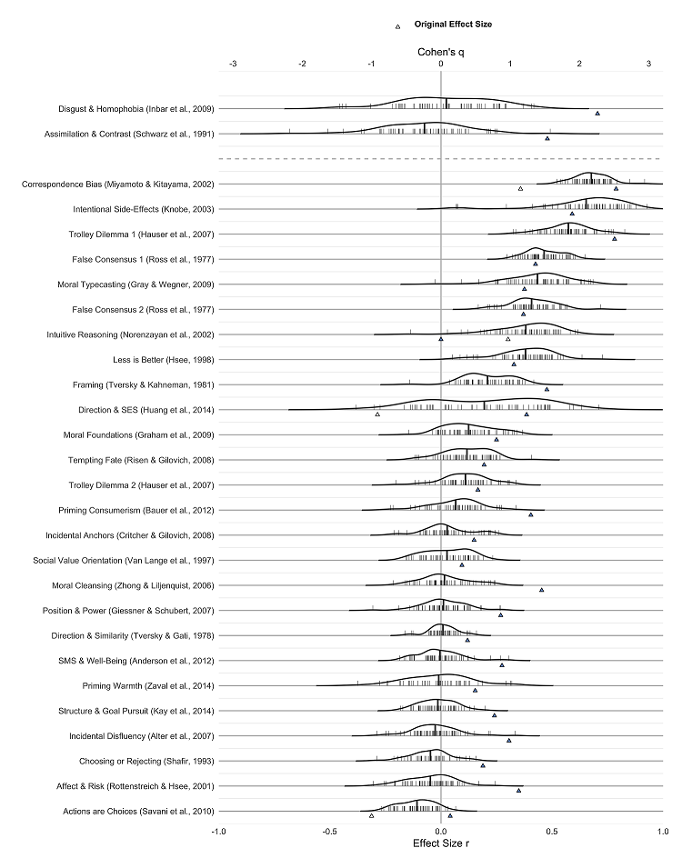

*EDIT: ML2 was published Dec 2018, [open access in AMPPS](https://journals.sagepub.com/doi/10.1177/2515245918810225). See also [the commentaries from original authors](https://www.psychologicalscience.org/publications/many-labs-2).*

*ORIGINAL:* 
The Many Labs 2 project has been submitted and is under review at [AMPPS](https://www.psychologicalscience.org/publications/ampps). Overall, 28 psychology studies were replicated across >120 samples from 34 countries around the world, totaling >15,000 participants.

Public release of the results/manuscript/data should occur shortly, pending final revisions and alongside commentaries from original authors.

<!--more-->

*EDIT: ML2 was published Dec 2018, [open access in AMPPS](https://journals.sagepub.com/doi/10.1177/2515245918810225). See also [the commentaries from original authors](https://www.psychologicalscience.org/publications/many-labs-2).*

*ORIGINAL:* 
The Many Labs 2 project has been submitted and is under review at [AMPPS](https://www.psychologicalscience.org/publications/ampps). Overall, 28 psychology studies were replicated across >120 samples from 34 countries around the world, totaling >15,000 participants.

Public release of the results/manuscript/data should occur shortly, pending final revisions and alongside commentaries from original authors.

