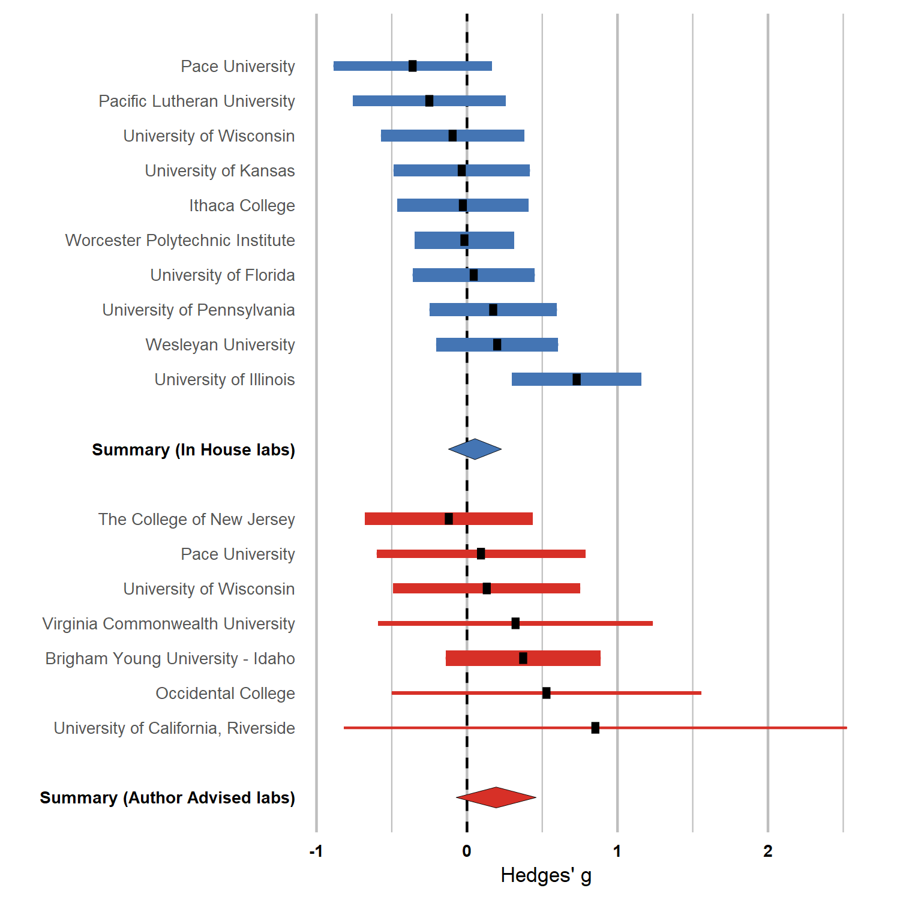

We released [Many Labs 4](https://online.ucpress.edu/collabra/article/8/1/35271/168050/Many-Labs-4-Failure-to-Replicate-Mortality) open access in Collabra: Psychology. We also wrote a [brief summary post](https://cos.io/blog/many-labs-4-failure-replicate-mortality-salience-effect-and-without-original-author-involvement/) for the COS blog. You can follow some discussion on Twitter [here](https://twitter.com/raklein3/status/1204839047354560513) or [here](https://twitter.com/BrianNosek/status/1204838107855675394).

<!--more-->

We released [Many Labs 4](https://online.ucpress.edu/collabra/article/8/1/35271/168050/Many-Labs-4-Failure-to-Replicate-Mortality) open access in Collabra: Psychology. We also wrote a [brief summary post](https://cos.io/blog/many-labs-4-failure-replicate-mortality-salience-effect-and-without-original-author-involvement/) for the COS blog. You can follow some discussion on Twitter [here](https://twitter.com/raklein3/status/1204839047354560513) or [here](https://twitter.com/BrianNosek/status/1204838107855675394).

