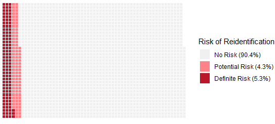

We just [published](https://www.nature.com/articles/s41562-022-01481-w#citeas) our findings and recommendations for researchers to better protect the privacy of research participants when sharing open data. Examining over 2,000 public datasets from papers using human participants, we found that 5-10% contained information that could potentially re-identify participants. 

<!--more-->

We just [published](https://www.nature.com/articles/s41562-022-01481-w#citeas) our findings and recommendations for researchers to better protect the privacy of research participants when sharing open data. Examining over 2,000 public datasets from papers using human participants, we found that 5-10% contained information that could potentially re-identify participants.

Furthermore, half of those datasets contained data touching on sensitive topics. We propose several practical recommendations that researchers should implement to safeguard their datasets from such liabilities before sharing them.

The paper is published at [Nature Human Behavior](https://www.nature.com/articles/s41562-022-01481-w#citeas) and we've also released a [pre-print](https://psyarxiv.com/ybzu9) with more detail about our methods. I presented some preliminary findings at the MetaScience Conference back in 2021 ([video link](https://youtu.be/w40J0-Z6epU?t=2634)).

