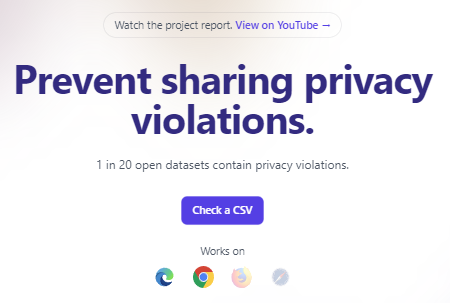

Our prior work demonstrated that [5-10% of open datasets contain potential privacy violations](https://www.nature.com/articles/s41562-022-01481-w#citeas), so we developed a tool to help. [DataCheck]((https://libscie.github.io/datacheck-website/)) can automatically scan a dataset and flag 14 types of common privacy violations before a researcher makes their data public. Available as both a [Web app](https://libscie.github.io/datacheck-website/)
and [R package](https://github.com/libscie/datacheck), the tool runs locally so there is no risk of exposing participant data during the scan. It was validated on both live and simulated datasets to be >98% accurate. 

<!--more-->

Our prior work demonstrated that [5-10% of open datasets contain potential privacy violations](https://www.nature.com/articles/s41562-022-01481-w#citeas), so we developed a tool to help. [DataCheck]((https://libscie.github.io/datacheck-website/)) can automatically scan a dataset and flag 14 types of common privacy violations before a researcher makes their data public. Available as both a [Web app](https://libscie.github.io/datacheck-website/)
and [R package](https://github.com/libscie/datacheck), the tool runs locally so there is no risk of exposing participant data during the scan. It was validated on both live and simulated datasets to be >98% accurate. 

